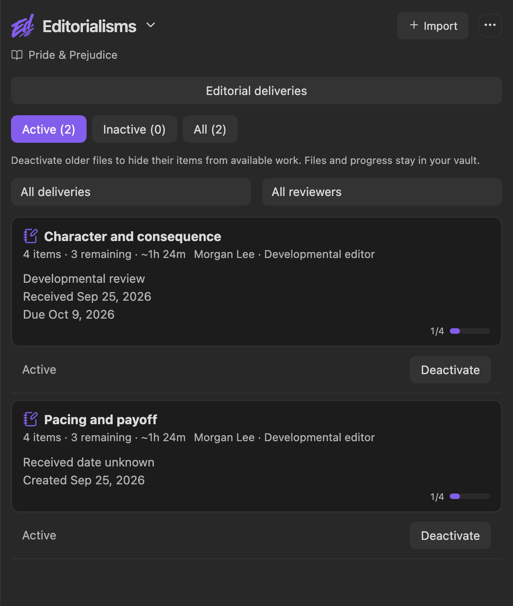
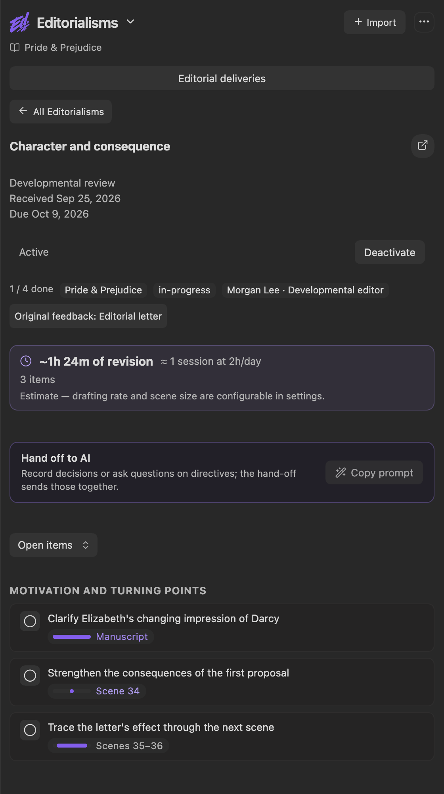

Editorialisms is the manuscript-wide commentary mode. Where [Review](Review-Panel) handles scene-level batches with line edits and [Pending Edits](Pending-Edits) handles author / Inquiry follow-ups, Editorialisms manages **Editorialism documents** — separate structural guidance files that span scenes, subplots, or the whole manuscript. It is for general feedback, not line edits.

<p align="center"></p>

## What an Editorialism is

An Editorialism is a plain markdown file in your vault — a themed checklist of editorial directives. It is not a review batch and it is not appended to scene notes. Examples of work that belongs here rather than in a review block:

- A development edit's structural agenda ("compress the middle act", "thread the antagonist earlier")
- Design intent and doctrine the manuscript should conform to
- Multi-session checklists you work through over weeks
- Subplot-level concerns that touch many scenes

Editorialism files live under `Editorialist/<Book>/<Title>.md` and are recognized by their frontmatter:

```yaml
---
type: editorialism
title: Middle-act compression
book: <must match the active book label exactly>
reviewer: Marla Quist
reviewer_type: developmental-editor
source: "[[Marla — editorial letter, June 2026]]"
status: in-progress
created: 2026-06-10
---
```

`reviewer:` and `reviewer_type:` say whose agenda this is, and the panel shows them beside the title. Saving a file through the launcher also adds that reviewer to the [contributor directory](Settings-Reference#contributors-tab), identity only — directives have no accept or reject, so no stats are recorded for them. `source:` is an optional link to a note that already exists in your vault holding the letter or document the agenda was distilled from; the panel renders it as a clickable chip. Editorialist does not save the letter for you. All three fields are optional, and an agenda without them is shown unattributed rather than given a guessed author.

When a second reviewer delivers an agenda with the same `title:` as one already saved, the launcher keeps them apart: the new file is saved as `<Title> (<Reviewer>).md` instead of overwriting the first. Re-saving from the same reviewer, or with neither file naming a reviewer, updates in place as before.

Files without `type: editorialism` are ignored. The full file format — section headings, task items, `[scope:: …]` and `[tags:: …]` metadata — is documented in [Importing Reviews § Format B](Importing-Reviews#format-b--the-editorialism-file). Reviewers (human or AI) can produce these files directly; the launcher's template includes the format.

**Getting a file into the panel.** The fastest path is the [review launcher](Importing-Reviews): paste an AI reply that contains an editorialism file (a ```` ```editorialism ```` fenced block, or just the `type: editorialism` frontmatter) and click **Import editorialism**. Editorialist writes it to `Editorialist/<Book>/<Title>.md`, creating the folder, and opens this panel. Identical re-imports leave the file untouched. Changed agendas require confirmation and preserve progress on unchanged instructions; different reviewers are kept apart. Creating the file by hand works too.

> Only files whose `book:` matches the active book label appear while that book is active. If a saved file doesn't show up, check that its `book:` value matches exactly.

## The panel

- **Header** — the active book label (or "No active book selected").
- **Document list** — files for the active book, filtered by activity, delivery, and reviewer; each shows remaining work, attribution, dates, and completion.
- **Detail view** — select a document to see its items grouped by section. A dropdown above the items shows **Open items** (the default), **This scene** (open items scoped to the scene you are in), or **All items**, including finished ones.

<p align="center"></p>

### Working items

Each item is a task line with one of five statuses. In the file, the status is the character inside the task brackets:

```
[ ] open   [/] in progress   [x] done   [-] deferred   [?] question
```

Clicking an item's status circle opens a menu naming every status — **Open**, **In progress**, **Done**, **Deferred**, **Question** — with the current one checked, so you always see what a click will set. The same menu offers **Ask a question…** and **Draft fixes with AI…**, both described below.

Because Editorialisms are plain markdown task lists, they stay fully readable and editable outside the panel — edit the file directly and the panel reflects it. The `[scope:: …]` metadata records which scene, range (`13–22`), subplot (`subplot:<name>`), or `manuscript` each directive applies to.

### Current-scene highlights

When you are working in a scene, Editorialist marks related Editorialism items with a green left accent. This helps you spot broad guidance that matters to the scene in front of you, without rereading the whole agenda.


Highlighting applies only to scene notes of the active book. Cut archives are always excluded, and in a Radial Timeline vault a note must carry `Class: Scene` — so a numbered Beat or outline note such as `29.01` does not light up as scene 29. Vaults without `Class` frontmatter are unaffected: there, any note in the book folder counts.

Rows light up when their `[scope:: …]` matches the current scene:

- A scene scope matches that scene number.
- A range scope matches when the current scene falls inside the range.
- A subplot scope matches when the subplot name overlaps the scene's character, subplot, or action / description frontmatter. For example, an item scoped to `[scope:: subplot:Cesena thread]` lights up while you are in a scene whose metadata mentions `Cesena`.

### Anchors — jumping to the passages a directive is about

A scope tells you *which scene*. An **anchor** tells you *which paragraph*. Anchors are the answer to the slow part of working an agenda: reading "thread the grief so it escalates" and then hunting through nine scenes for the places that need work.

An anchor is a nested task line under a directive, carrying a verbatim fragment of the manuscript:

```markdown
- [ ] Grief should escalate, not reset each scene [scope:: 13–22]
  - [ ] 14 "She poured the coffee and didn't look up."
  - [ ] 17 "Marla laughed" → "nobody else was laughing."
  - [x] 21 "It had been six months."
```

The two-fragment form (`"opening" → "closing"`) anchors a whole passage between the fragments; the single-fragment form anchors one stretch of prose. A trailing `— note` after the fragment is optional.

**An anchor is not an edit.** It carries no replacement text and Editorialist never applies it. Clicking one opens that scene, selects the passage, and highlights the directive's *other* anchors in the same scene — so a comment that touches three places shows all three at once. You read, revise however you see fit, and mark the anchor processed. The editing stays yours.

Anchors have the same five-state status as directives; **done** and **deferred** both retire an anchor from the walk. In this panel, clicking an anchor's circle steps it to the next status in the order shown above. Marking the last one does not mark the directive done — that call is yours.

**Getting anchors:**

- **From a reviewer.** The launcher template asks for anchors whenever a directive is about particular passages, so an AI or editor working from your manuscript can supply them with the agenda.
- **From a selection.** Select a passage in a scene and run **Anchor selection to editorialism directive** (also on the editor right-click menu), then pick the directive. Long or multi-line selections are stored as a span automatically.

**Walking the agenda.** `Go to next unprocessed anchor` moves to the next one in document order, opening scenes as it goes; `Mark anchor processed and go to next` records the current one and advances. Assign hotkeys to those two and you can work an entire directive without touching the panel. The walk stops at the end rather than looping, so finishing is visible.

### Decisions

Many directives are really a choice — *choose her age*, *raspberries or blueberries* — whose answer then has to be carried through every scene they name. Editorialist treats a directive as a decision when it is marked `[?]` without a written question, already has a recorded decision, or opens with *choose*, *decide*, *pick*, or a similar choosing phrase. Such a directive shows **Decision needed** with a **Decide** button wherever it appears: here, in the Review panel's **Editorialisms** card, and under **Editorialism on this passage** on a suggestion card.

**Decide** asks for your answer and writes it onto the directive's line in the file:

```markdown
- [ ] Choose the breakfast berry [scope:: 4–19] [decision:: raspberries]
```

From then on the directive leads with **Decided: raspberries**, and each passage it names becomes a check that it matches. **Change** edits the answer; **Clear decision** removes it. Recording a decision on a `[?]` item reopens it to `[ ]` — the choice is made, and what remains is applying it. Any other status is left as you set it.

### Questions

When a directive leaves you with a question rather than a choice, pick **Question** in the status menu, or **Ask a question…**. Editorialist asks you to write the question down, saves it on the line, and marks the item `[?]`. Cancelling changes nothing.

```markdown
- [?] Keep the footage delay consistent [scope:: 44–47] [question:: Is the footage delayed, or is scene 47 wrong?]
```

The question shows under the directive as **Your question**, with **Edit** to change it. A directive with a written question is not also flagged **Decision needed**.

Decisions and questions are plain inline fields, so you can edit them by hand like the rest of the file. When a reviewer sends an updated version of an agenda you have already imported, a decision or question you recorded stays on any unchanged directive whose incoming line does not carry its own.

### Handing directives to AI

Much of what directives ask for is bookkeeping — an age, a date, a count that must agree everywhere — which is exactly what line edits are for. Two actions copy a prompt asking an AI to draft those edits:

- **Draft fixes with AI…** — in a directive's status menu, here or in the Review panel's **Editorialisms** card. The prompt covers that one directive: its text, your recorded decision marked as settled, and the verbatim paragraph around each open passage with its SceneId, so the AI can quote the manuscript exactly. It asks for one review block that implements the directive. If the directive needs a decision you have not recorded, the AI is asked to choose, say which, and apply that choice consistently.
- **Hand off to AI** — a card near the top of each agenda. **Copy prompt** sends every unfinished directive you have said something about in one go: decisions to carry out as line edits, and questions to answer in memos on the relevant scene, with edits where the answer calls for them. Directives you have not touched stay with you, and the button is disabled until at least one directive has a decision or a question.

Paste the prompt into your AI, then bring the reply back through the [review launcher](Importing-Reviews#importing-a-review-batch). It arrives as an ordinary review batch, and you sweep its suggestions like any other. The agenda file itself is not rewritten.

### Directives during a review sweep

Directives do not only wait here. When you run a review sweep on a scene these directives cover, they appear in an **Editorialisms** card in the Review panel — one at a time, with **Show all** for the full list. When the suggestion you are on sits in a paragraph a directive names, the suggestion card also shows it under **Editorialism on this passage**, with **Done** to retire just that passage. Statuses, decisions, and questions set there write straight back to the Editorialism file, so the two surfaces stay in step. See [Review panel § Editorialisms](Review-Panel#editorialisms) for the details.

> **When a passage has moved.** Anchors are resolved against the live note every time — offsets are never stored. If you have rewritten the prose so the fragment no longer matches, the anchor is marked unlocated on its row with the fragment shown, rather than silently jumping to a nearby paragraph. Re-anchor it from a new selection.

## When to use which

| Situation | Use |
|---|---|
| Concrete prose change to a specific passage | [Review batch](Importing-Reviews#format-a--the-review-batch) → imported review blocks → Review Panel |
| Commentary on a scene or the batch | `=== MEMO ===` in a review block |
| Directive spanning scenes, subplots, or the whole book | Editorialism file → this panel |
| Broad note that keeps sending you hunting for the passages | Add anchors to the directive |
| Directive that asks you to choose | **Decide** once; each passage becomes a check against the answer |
| Tedious bookkeeping directive — an age, a date, a count to harmonize | **Draft fixes with AI…** → review batch → Review Panel |
| Author note or Radial Timeline Inquiry follow-up | [Pending Edits](Pending-Edits) |
| A reviewer sends both line edits and structural notes | Both formats in one reply — each goes to its own surface |

## Activate or deactivate files

The Editorialisms panel lists files for the current book. Use **Active**, **Inactive**, or **All** to filter the list; each filter shows its file count. Each file shows its total and remaining item counts, with an **Activate** or **Deactivate** button. The same control is available when a file is open.

Deactivation writes `status: inactive` in that Editorialism file's frontmatter. It preserves the file, its checklist progress, attribution, and anchors. Its items no longer appear in the revision plan's **Available work** or as scene-review suggestions. Existing files remain active unless their status is explicitly `inactive`. Activation writes `status: active`.

Tasks already added to a revision plan stay there with **Source inactive** displayed. They continue to count toward estimates and the deadline until you explicitly finish or remove them. Reactivating a file makes its unfinished, unplanned items available again.

The revision plan's **Editorialisms** filter refers to the individual checklist items within these files.

## Editorial deliveries, dates, and deadlines

Choose **Editorial deliveries** in the Editorialisms view, or from any panel's three-dot menu. Create a delivery for one editor's handoff, such as “Developmental edit — Round 1”. Enter the reviewer, role, received date, return deadline, and an optional existing source note path. Link its imported batches and Editorialism files using the checkboxes. Linking does not duplicate feedback or change original reviewer attribution.

A source can belong to one delivery. To move it, unlink it from its current delivery first. Deliveries show checklist progress per file and suggestion decisions per batch; batch memos do not have completion decisions. Missing linked sources remain visible as unavailable.

Editorialism cards show the delivery and its dates. Old files without a known receipt date say **Received date unknown**; a recorded `created` date is shown separately when present. Cards sort by receipt date, then recorded creation date when receipt is unknown, with undated files last. Last-modified timestamps are available on hover over the date block and never treated as receipt dates. Filter the list by delivery or reviewer; unattributed files are labeled explicitly.

Revision-plan Available work can also be filtered by delivery. Linked items show the delivery's return deadline. A planned task scheduled after that deadline displays a warning. Delivery deadlines do not change the book-level deadline, your daily capacity, or scheduled work dates.

Deliveries are saved in plugin data alongside revision plans. Existing feedback remains unassigned until you link it. Imports still use the separate batch and Editorialism actions; creating a delivery does not automatically convert an editor's original document.

## Plan the work

See [Revision Plan](Revision-Plan#automatically-plan-a-delivery) to plan one delivery, and [Auto-plan](Revision-Plan#auto-plan-the-whole-book) for presets, effort ranges, working capacity, and draft schedules. One delivery can contain both batches and Editorialism files.
