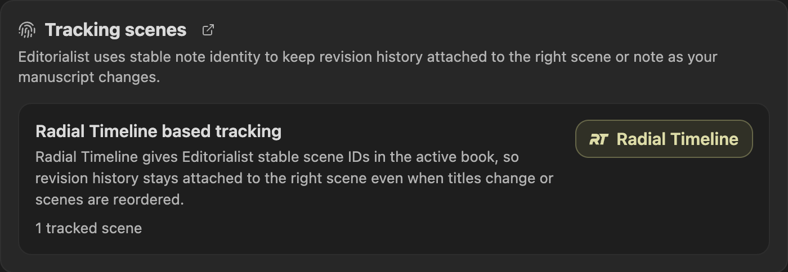

**Editorialist turns outside feedback and author notes into controlled revision workflows inside Obsidian.**

It is for writers who get notes from human editors, beta readers, or AI and want to work through those notes without losing control of the manuscript. Editorialist gives the Ed side panel three modes: scene-level review batches, manuscript-wide Editorialisms, and pending edits gathered from author notes or Radial Timeline Inquiry.

The plugin does not rewrite your prose on import. Line edits, memos, author questions, and pending-edit notes stay reviewable until you decide what to do with them. Accepted cuts can be backed up to per-scene cut files, and completed sweeps update revision history, contributor stats, and per-scene progress.

> [!IMPORTANT]
> **Radial Timeline + Editorialist**  
> Editorialist is designed to tightly integrate with [Radial Timeline](https://community.obsidian.md/plugins/radial-timeline), creating a synergistic relationship: use RT for manuscript design, planning, project management, and analysis; use Ed for systematic editorial sweeps.
>
> 

>
> Editorialist can use [Radial Timeline](https://community.obsidian.md/plugins/radial-timeline) for active-book scope and scene IDs, but it also works on its own.

## AI-Agnostic by Design

Editorialist ships a review format, not an AI. It makes no network calls and holds no API keys — a review batch is just text you paste in, however it was produced. It works the same way with an AI model, a human editor, or beta readers: whoever (or whatever) can follow the format can contribute suggestions.

## What It Helps With

- Turning AI, editor, or beta-reader feedback into reviewable suggestions.
- Walking a revision pass scene by scene instead of managing loose notes.
- Keeping every manuscript change explicit and reversible during the session.
- Tracking reviewer contributions, accepted suggestions, and revision progress.
- Keeping structural guidance separate from line-level edits through Editorialisms.

## Standard Review Operations

The standard Review workflow supports a full set of scene-level editorial moves:

| Operation | What it lets you do |
|---|---|
| **Edit** | Review a specific suggested change against the original passage. |
| **Move** | Relocate a passage before or after a named destination anchor. |
| **Cut** | Remove a passage, with optional backup to the scene's cut file first. |
| **Condense** | Tighten a passage between two anchors into a shorter version. |
| **Expand** | Develop, slow down, or decompress a beat with finished prose or advisory guidance. |
| **Memo** | Keep general thoughts, strengths, issues, or scene notes beside the sweep without changing prose. |

## Three Panel Modes

| Mode | Use it for |
|---|---|
| **Review** | Traditional Editorialist review batches: scene-level edits such as expand, condense, cut, move, and line edits, plus `%%ai: question%%` responses and scene memos. Each scene can carry multiple batches from different manuscript shares or review passes. |
| **Pending edits** | Author pending-edit notes and Radial Timeline Inquiry follow-ups gathered across the active book, then walked scene by scene. |
| **Editorialisms** | Manuscript-wide commentary: structural guidance, theme/subplot notes, and general feedback with no line edits. |

## What You Work With

| Object | What you get | When you get it | Where it lives |
|---|---|---|---|
| **Review batch** | The AI's formatted response: line edits, cuts, moves, condenses, expands, and memos | After you send the formatting instructions and manuscript text to an AI, or ask an AI to convert human notes | On your clipboard until you import it |
| **Review block** | The imported part of a review batch for one scene | When you import a review batch through the launcher | Appended to the bottom of each targeted scene note |
| **Editorialism** | A structural checklist or manuscript-level directive set | When a reviewer gives broad guidance that should be worked over time | A separate markdown file under `Editorialist/<Book>/` |
| **Pending edit** | A note-to-self or Inquiry follow-up to review later | When it is written into Radial Timeline / scene revision metadata | Read from the active book and shown in Pending edits mode |

## Core Workflow

1. **Copy the formatting instructions** from the review launcher — they include the [format specification](Importing-Reviews) and your book's scene IDs.
2. **Get suggestions.** Paste the instructions into your AI conversation along with the prose. For human feedback, collect your reviewer's notes in any form — a photo of a marked-up page, a document, an email — and have an AI shape them into a batch using the same instructions.
3. **Import the batch** through the launcher; Editorialist appends review blocks to the bottom of the targeted scene notes.
4. **Walk the [guided review sweep](Review-Panel)** — accept, reject, rewrite, or defer each suggestion.
5. **Finish.** Per-scene progress, contributor stats, and revision history update as each sweep completes.

## Pages

| Page | What's there |
|---|---|
| [Getting Started](Getting-Started) | Commands and your first review sweep |
| [Review Panel](Review-Panel) | The main working surface — sessions, the suggestion toolbar, statuses |
| [Pending Edits](Pending-Edits) | The active-book queue for author notes and Inquiry follow-ups |
| [Editorialisms Panel](Editorialisms-Panel) | Structural guidance documents and the checklist workflow |
| [Importing Reviews](Importing-Reviews) | Review batches, review blocks, and Editorialism files |
| [Settings Reference](Settings-Reference) | All three settings tabs: Core, Contributors, Configuration |
| [Radial Timeline Integration](Radial-Timeline-Integration) | What the companion plugin adds |

## License

Source-available, non-commercial software license. Free for personal, educational, and professional creative work — including manuscripts and other commercial creative output produced with the plugin. Commercial use of the software itself, redistribution, and forks for public distribution require written permission. See [LICENSE](https://github.com/EricRhysTaylor/Editorialist/blob/main/LICENSE) for full terms.
