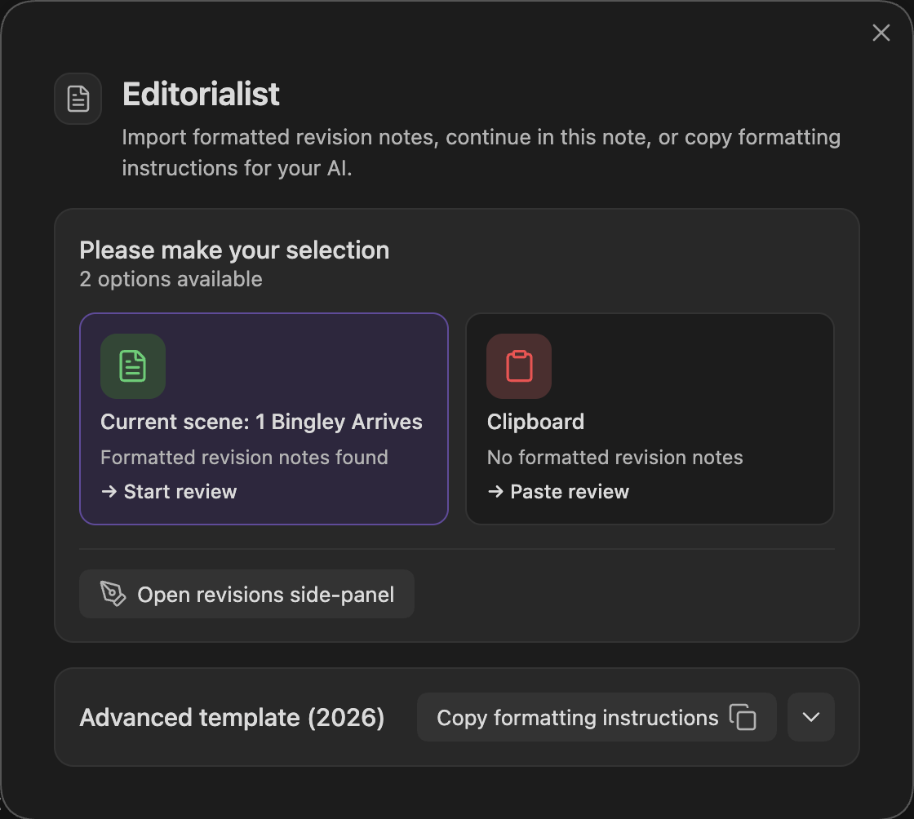

This page documents what can come back from a reviewer or AI, where each object goes, and how a review batch gets into your vault.

The formats are written for an AI to produce. For an AI review, paste the formatting instructions into the conversation along with your prose. When the feedback comes from a human — margin notes on a printed page, a marked-up document, an email — hand their notes to an AI together with these same instructions, and it shapes them into Editorialist-ready output with your human reviewer credited as the contributor. A human never works from this format directly.

> **Tip:** you never need to write this format by hand. The review launcher's **Copy formatting instructions** button puts the full specification — including your book's real scene IDs — on the clipboard, ready to paste into an AI conversation.

---

## What You Can Get Back

The launcher's template includes two output formats. They are different objects with different jobs:

| Object | Use it for | When you get it | Where it goes |
|---|---|---|---|
| **Review batch** | Concrete suggestions for specific passages in specific scenes | After an AI review, or after an AI converts human notes into Editorialist format | Imported through the review launcher, then split into per-scene review blocks |
| **Review block** | The scene-local copy of the imported suggestions | Created by Editorialist when you import a review batch | Appended to the bottom of each targeted scene note |
| **Editorialism file** | Structural or manuscript-level guidance that should be worked as a checklist | When feedback is broader than scene-targeted line edits | Saved as a separate file under `Editorialist/<Book>/<Title>.md` |

Most revision passes use a **review batch**. Use an **Editorialism file** when the output is a durable checklist: subplot work, design rules, multi-scene directives, or manuscript-level guidance.

---

## Format A — the review batch

A review batch is usually a fenced code block labelled `editorialist-review`. It is the AI response you copy back into Editorialist:

````markdown
```editorialist-review
Template: Editorialist advanced
Reviewer: GPT-5.4
ReviewerType: ai-editor
Provider: OpenAI
Model: GPT-5.4

=== MEMO ===
Strengths:
What is working across the scenes you reviewed.

Issues:
Patterns or risks to surface before the author works through the line edits.

=== EDIT ===
SceneId: scn_first_scene_id
Original: ...
Revised: ...
Why: ...

=== CUT ===
SceneId: scn_xxxxxxxx
Target: ...
Why: ...
```
````

**Fences are optional.** Most chat UIs strip the outer triple-backtick fence when you copy a reply. The importer accepts both fenced and unfenced output — what matters is the metadata header and the `=== SECTION ===` markers. Decorative divider lines some LLMs emit between sections (`⸻`, `---`, `***`, `═══`) are skipped harmlessly.

When imported, Editorialist groups the batch by target scene and appends one review block to the bottom of each targeted scene note. The block stores the suggestions and memo text for that scene; it does not apply changes to the manuscript.

### Metadata header

The lines before the first `=== SECTION ===` marker identify the batch and the contributor:

| Field | Purpose |
|---|---|
| `Reviewer:` | Display name of the contributor (person or model) |
| `ReviewerType:` | Role — e.g. `human-editor`, `beta-reader`, `ai-editor` |
| `Provider:` / `Model:` | For AI contributors — drives the provider brand icon in the [contributor directory](Settings-Reference#contributors-tab) |
| `Template:` / `TemplateYear:` / `SupportedOperations:` | Emitted by the template; identifies which format version produced the batch |

### Operations

`MEMO` and `QUERY` carry commentary rather than a line edit — neither ever applies to the prose. The five operations below them are actionable suggestions (their UI labels are **Edit**, **Move**, **Cut**, **Condense**, **Expand**):

| Section | Fields | What it does |
|---|---|---|
| `=== MEMO ===` | freeform, optional `Strengths:` / `Issues:`, optional `SceneId:` | Commentary that doesn't belong inline as a line edit. A MEMO **with** a `SceneId` attaches to that scene only; a MEMO **without** one is duplicated to every scene that received edits in the batch. Use as many as needed. |
| `=== QUERY ===` | `Id:`, optional `SceneId:`, `Question:`, `Answer:`, optional `Recommendation:` | Answers an author query — a hidden `%%ai: …%%` marker the author left inline. See [Author queries](#author-queries) below. |
| `=== EDIT ===` | `SceneId:`, `Original:`, `Revised:`, `Why:` | Replace `Original` text with a specific suggested change. |
| `=== MOVE ===` | `SceneId:`, `Target:`, `Before:` (or `After:`), `Why:` | Relocate the target passage relative to a destination anchor. |
| `=== CUT ===` | `SceneId:`, `Target:`, `Why:` | Remove the target passage. Accepted cuts can be [backed up to a cut file](Settings-Reference#configuration-tab) first. |
| `=== CONDENSE ===` | `SceneId:`, `Target:`, `Suggestion:`, `Why:` | Tighten the passage between two anchors into the suggested replacement. |
| `=== EXPAND ===` | `SceneId:`, `Target:`, optional `Suggestion:`, `Why:` | Develop, slow down, or decompress a beat with finished prose or advisory guidance. |

### Author queries

An author query is a hidden `%%ai: <question>%%` marker you leave inline in a scene — run **Insert author query** (command palette, editor right-click menu, or the Review Panel's header button) to drop one at the cursor. It never renders in reading view; it just waits for the next review pass.

The round trip:

1. **Marker.** You (or Editorialist's **Insert author query** action) write `%%ai: <question>%%` into the scene.
2. **Template.** When you copy the formatting instructions, Editorialist finds every marker in the passage, strips it from the copy sent to the reviewer, and lists the questions with instructions to answer each one in its own `=== QUERY ===` block.
3. **QUERY answer.** The reviewer's reply includes a `=== QUERY ===` section per question: the repeated `Question:`, a direct `Answer:`, and an optional one-line `Recommendation:`.
4. **Resolve or dismiss.** On import, the answer routes back to the scene the marker sits in. Resolving a query strips the matching `%%ai:…%%` marker from the note; dismissing it records your decision but leaves the marker in place for a later pass.

### CONDENSE anchor pairs

The CONDENSE target uses a two-anchor format:

```
Target: "<verbatim opening fragment>" → "<verbatim closing fragment>"
```

Both fragments should be copied from the manuscript (≤12 words each is plenty — they're anchors, not the whole passage). Editorialist tries exact matching first, then a quote/dash/whitespace-tolerant match. A paraphrased description still routes the suggestion to "Passage not located" and you can't act on it.

### EXPAND: direct vs. advisory

Include a `Suggestion:` with finished prose and the expand is **direct** — applicable with one click, like an edit. Omit the `Suggestion:` and the entry stays **advisory** — guidance you develop by hand.

### Scene IDs

Every operation entry targets one scene via `SceneId:`. Items in the same block may target different scenes — the importer routes each entry to its own scene.

- IDs must be **real values** from the manuscript or the scene-ID list the template includes. Invented or placeholder IDs (`scn_xxxxxxxx`) route a batch to the wrong scene silently.
- If a reviewer can't identify the scene for a passage, the right move is to **omit the SceneId entirely** — Editorialist routes those entries to the scene you're currently viewing and flags them for manual verification, which is recoverable. A confidently wrong ID is not.
- If a Radial Timeline manuscript export was the reviewer's input, scene IDs appear inline in that export and match the template's list. See [Radial Timeline Integration](Radial-Timeline-Integration).

### Matching against the manuscript

`Original:` and `Target:` text is matched **conservatively** against the live note: exact text first, then a quote/dash/whitespace-tolerant fallback. Editorialist also checks whether the suggested replacement already appears to be applied. Each suggestion gets a match type — exact, multiple matches, not found, or already applied — surfaced in the review UI so you know what you're acting on.

---

## Format B — the Editorialism file

For structural work — scene-range directives, manuscript-wide design intent, a checklist the author walks through across multiple sessions — the reviewer outputs a complete markdown file instead:

```markdown
---
type: editorialism
title: <Short, descriptive title>
book: <Active book name — must match the book label exactly>
status: in-progress
created: 2026-06-10
---

# <Same as title>

## <Theme or pillar — one section per major concern>
- [ ] Specific actionable directive [scope:: <scope>] [tags:: <tag1>, <tag2>]
- [ ] Another directive in the same theme [scope:: <scope>]

## <Another section>
- [ ] Single-scene directive [scope:: 22]
- [ ] Scene-range directive [scope:: 13–22]
- [ ] Manuscript-wide design directive [scope:: manuscript]
- [ ] Subplot-level work [scope:: subplot:Shail IT subplot]
```

Paste the reply into the review launcher: when it contains an editorialism file, the launcher shows a **Save editorialism file** action that writes it to `Editorialist/<Book>/<Title>.md` (creating the folder), then opens the [Editorialisms Panel](Editorialisms-Panel). Re-saving the same `title:` overwrites the prior version in place. You can still create the file by hand if you prefer — the panel picks up any `type: editorialism` file under `Editorialist/`.

**Required:**
- Frontmatter `type: editorialism` — files without this are ignored.
- `book:` must match the active book label exactly.

**Inline metadata per item:**
- `[scope:: <value>]` (recommended): `manuscript` (whole book), a scene number (`22`), a range (`13–22`, en-dash or hyphen), or `subplot:<name>`.
- `[tags:: tag1, tag2]` (optional).

**Status markers** (the character inside the task brackets):

| Marker | Status |
|---|---|
| `[ ]` | open |
| `[/]` | in progress |
| `[x]` | done |
| `[-]` | deferred |
| `[?]` | question |

---

## Importing a Review Batch

<p align="center"></p>

Run **Open review launcher** (command palette). The launcher modal:

1. **Checks your clipboard** — if it detects a review batch, one click imports it.
2. **Manual paste** — if the clipboard is empty or contains something else, open the manual-import area and paste; validation runs in real time with specific error messages.
3. **Route assignment** — entries that need routing decisions (e.g. missing SceneIds) get an assignment step before anything is written.
4. **Template copy** — the launcher's template button copies the full format guidance, both templates, and your book's actual scene-ID list to the clipboard.

Import appends review blocks to the targeted scene notes. Nothing else in the note is touched, and no suggestion is applied until you act on it in the [Review Panel](Review-Panel).
