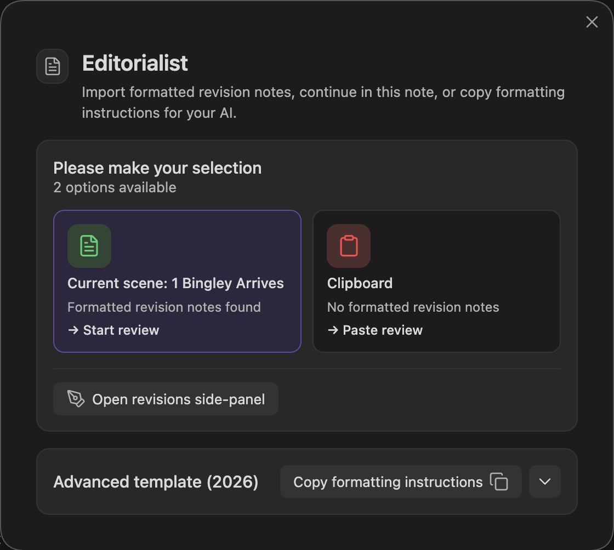

This page documents what can come back from a reviewer or AI, where each object goes, and how a review batch gets into your vault.

The formats are written for an AI to produce. For an AI review, paste the formatting instructions into the conversation along with your prose. When the feedback comes from a human — margin notes on a printed page, a marked-up document, an email — hand their notes to an AI together with these same instructions, and it shapes them into Editorialist-ready output with your human reviewer credited as the contributor. A human never works from this format directly.

> **Tip:** you never need to write this format by hand. The review launcher's **Copy formatting instructions** button puts the full specification — including your book's real scene IDs — on the clipboard, ready to paste into an AI conversation.

---

## What You Can Get Back

The launcher's template includes two output formats. They are different objects with different jobs:

| Object | Use it for | When you get it | Where it goes |
|---|---|---|---|
| **Review batch** | Concrete suggestions for specific passages in specific scenes | After an AI review, or after an AI converts human notes into Editorialist format | Imported through the review launcher, then split into per-scene review blocks |
| **Review block** | The scene-local copy of the imported suggestions | Created by Editorialist when you import a review batch | Appended to the bottom of each targeted scene note |
| **Editorialism file** | Structural or manuscript-level guidance that should be worked as a checklist | When feedback is broader than scene-targeted line edits | Saved as a separate file under `Editorialist/<Book>/<Title>.md` |

Most revision passes use a **review batch**. Use an **Editorialism file** when the output is a durable checklist: subplot work, design rules, multi-scene directives, or manuscript-level guidance.

---

## Format A — the review batch

A review batch is usually a fenced code block labelled `editorialist-review`. It is the AI response you copy back into Editorialist. Replace attribution placeholders with the actual reviewer: credit the human when converting their feedback and omit Provider/Model; for an independent AI review, use its actual identity without guessing a model version. Keep any additional AI advice separate from the human’s notes.

````markdown
```editorialist-review
Template: Editorialist advanced
Reviewer: <Actual reviewer name or model name>
ReviewerType: <Accepted role for the actual reviewer>
Provider: <Actual AI provider; omit for human feedback>
Model: <Actual model if known; otherwise omit>

=== MEMO ===
Strengths:
What is working across the scenes you reviewed.

Issues:
Patterns or risks to surface before the author works through the line edits.

=== EDIT ===
SceneId: scn_first_scene_id
Original: ...
Revised: ...
Why: ...

=== CUT ===
SceneId: scn_xxxxxxxx
Target: ...
Why: ...
```
````

**Fences are optional.** Most chat UIs strip the outer triple-backtick fence when you copy a reply. The importer accepts both fenced and unfenced output — what matters is the metadata header and the `=== SECTION ===` markers. Decorative divider lines some LLMs emit between sections (`⸻`, `---`, `***`, `═══`) are skipped harmlessly.

When imported, Editorialist groups the batch by target scene and appends one review block to the bottom of each targeted scene note. The block stores the suggestions and memo text for that scene; it does not apply changes to the manuscript.

### Metadata header

The lines before the first `=== SECTION ===` marker identify the batch and the contributor:

| Field | Purpose |
|---|---|
| `Reviewer:` | Display name of the contributor (person or model) |
| `ReviewerType:` | Role. Human: `editor`, `developmental-editor`, `line-editor`, `copy-editor`, `publisher-editor`, `agent`, `beta-reader`, `sensitivity-reader` (`human-editor` is accepted as `editor`). AI: `ai-editor`, `ai-developmental-editor`, `ai-line-editor`, `ai-copy-editor`. Anything unrecognised is treated as the author. |
| `Provider:` / `Model:` | For AI contributors — drives the provider brand icon in the [contributor directory](Settings-Reference#contributors-tab) |
| `Template:` / `TemplateYear:` / `SupportedOperations:` | Emitted by the template; identifies which format version produced the batch |

### Operations

`MEMO` and `QUERY` carry commentary rather than a line edit — neither ever applies to the prose. The five operations below them are actionable suggestions (their UI labels are **Edit**, **Move**, **Cut**, **Condense**, **Expand**):

| Section | Fields | What it does |
|---|---|---|
| `=== MEMO ===` | freeform, optional `Strengths:` / `Issues:`, optional `SceneId:` | Commentary that doesn't belong inline as a line edit. A MEMO **with** a `SceneId` attaches to that scene, whether or not the scene received edits; a MEMO **without** one is duplicated to every scene in the batch. Use as many as needed. |
| `=== QUERY ===` | `Id:`, optional `SceneId:`, `Question:`, `Answer:`, optional `Recommendation:` | Answers an author query — a `%%query: …%%` marker the author left inline. See [Author queries](#author-queries) below. |
| `=== EDIT ===` | `SceneId:`, `Original:`, `Revised:`, `Why:` | Replace `Original` text with a specific suggested change. |
| `=== MOVE ===` | `SceneId:`, `Target:`, `Before:` (or `After:`), `Why:` | Relocate the target passage relative to a destination anchor. |
| `=== CUT ===` | `SceneId:`, `Target:`, `Why:` | Remove the target passage. Accepted cuts can be [backed up to a cut file](Settings-Reference#configuration-tab) first. |
| `=== CONDENSE ===` | `SceneId:`, `Target:`, optional `Suggestion:`, `Why:` | Tighten the passage between two anchors, with a suggested replacement or advisory guidance. |
| `=== EXPAND ===` | `SceneId:`, `Target:`, optional `Suggestion:`, `Why:` | Develop, slow down, or decompress a beat with finished prose or advisory guidance. |

Any of the five actionable entries may also carry an optional `Context:` field — see [Context across scenes](#context-across-scenes).

### Context across scenes

A fix often depends on another scene: the same object, date, or event recurs there, or an earlier scene already established what this one changes. `Context:` names those passages, one reference per line — the scene number, then a fragment copied verbatim from that scene. A span uses the same `"opening" → "closing"` form as a CONDENSE target:

```
=== EDIT ===
SceneId: scn_xxxxxxxx
Original: ...
Revised: ...
Why: Scene 65 already treats the reunion as settled.
Context: 65 "the reunion at Terminus"
- 64 "Wala3 arranges the handover" → "through an XO."
```

When you review that suggestion, the referenced paragraphs appear in the **Across scenes** section of the suggestion card, labelled **Quoted reference**, each with **Open beside** to read it in a side pane without losing your place. Context is never applied to the manuscript. A line that does not read as a scene number and a quoted fragment is ignored rather than guessed at. Self-contained line edits need no `Context:`.

### Memo-only batches

A batch does not need any line edits. An editorial letter, a developmental read, or an agent's notes often arrive as commentary alone, and the natural conversion is one `MEMO` per scene discussed plus unscoped `MEMO`s for the manuscript as a whole. Each scoped memo is appended to its own scene as a review block; unscoped memos go to every scene in the batch. When a batch has no edits and no `SceneId`s at all, the memos attach to the scene you have open. A memo whose `SceneId` matches nothing is not imported. The launcher says so before you import — a warning under the paste box, and a line in the destination preview naming the memo — rather than dropping it quietly. A clipboard import that would leave a memo behind opens the destination preview instead of importing straight away; **Import placed entries** there brings in everything that has a home.

### Author queries

An author query is a `%%query: <question>%%` marker you leave inline in a scene — run **Insert author query** (command palette, editor right-click menu, or the panel’s **… → Insert author query** action) to drop one at the cursor. Obsidian hides it in reading view, and it travels with the manuscript until the next review pass answers it — your editor's next round, or an AI pass in between.

A query is hidden only inside Obsidian. A manuscript export keeps it unless you strip author queries, so anyone reading that file sees it: keep them in what you send a reviewer, and strip them from anything meant for readers. Radial Timeline's export has a **Strip author queries** toggle for this.

Markers written before 2.0.1 use the original name, `%%ai: <question>%%`. Editorialist still reads, answers and resolves them; new markers are written as `%%query:`.

The round trip:

1. **Marker.** You (or Editorialist's **Insert author query** action) write `%%query: <question>%%` into the scene.
2. **Template.** When you copy the formatting instructions, Editorialist finds every marker in the passage, strips it from the copy sent to the reviewer, and lists the questions with instructions to answer each one in its own `=== QUERY ===` block.
3. **QUERY answer.** The reviewer's reply includes a `=== QUERY ===` section per question: the repeated `Question:`, a direct `Answer:`, and an optional one-line `Recommendation:`.
4. **Resolve or dismiss.** On import, the answer routes back to the scene the marker sits in. Resolving a query strips the matching `%%query:…%%` marker from the note; dismissing it records your decision but leaves the marker in place for a later pass.

### CONDENSE anchor pairs

The CONDENSE target uses a two-anchor format:

```
Target: "<verbatim opening fragment>" → "<verbatim closing fragment>"
```

Both fragments should be copied from the manuscript (≤12 words each is plenty — they're anchors, not the whole passage). Editorialist tries exact matching first, then a quote/dash/whitespace-tolerant match. A paraphrased description still routes the suggestion to "Passage not located" and you can't act on it.

### CONDENSE and EXPAND: direct vs. advisory

`Suggestion:` is optional on both, and it decides what you get:

- **With a `Suggestion:`** — the entry is **direct**. The reviewer's wording sits beside the original and applies in one click, like an edit.
- **Without one** — the entry is **advisory**. The panel shows *Condense this paragraph* or *Develop this beat* in place of the prose, with the reviewer's `Why:` as the direction. You rewrite the passage yourself and mark it rewritten — see [Advisory suggestions](Review-Panel#advisory-suggestions).

Advisory is the honest answer when a beat needs your voice rather than the reviewer's. The formatting instructions say so explicitly, so a reviewer working from them should offer guidance instead of inventing prose it isn't confident in — a fabricated `Suggestion:` is worse than a direction, because it arrives one click from your manuscript looking finished.

### Scene IDs

Every operation entry targets one scene via `SceneId:`. Items in the same block may target different scenes — the importer routes each entry to its own scene.

- IDs must be **real values** from the manuscript or the scene-ID list the template includes. Unmatched IDs are surfaced in the destination preview; a wrong ID that happens to name a real scene can misroute feedback, so never guess.
- If a reviewer can't identify the scene for a passage, the right move is to **omit the SceneId entirely** — Editorialist routes those entries to the scene you're currently viewing and flags them for manual verification, which is recoverable. A confidently wrong ID is not.
- If a Radial Timeline manuscript export was the reviewer's input, scene IDs appear inline in that export and match the template's list. See [Radial Timeline Integration](Radial-Timeline-Integration).

### Matching against the manuscript

`Original:` and `Target:` text is matched **conservatively** against the live note: exact text first, then a quote/dash/whitespace-tolerant fallback. Editorialist also checks whether the suggested replacement already appears to be applied. Each suggestion gets a match type — exact, multiple matches, not found, or already applied — surfaced in the review UI so you know what you're acting on.

---

## Format B — the Editorialism file

For structural work — scene-range directives, manuscript-wide design intent, a checklist the author walks through across multiple sessions — the reviewer outputs a complete markdown file instead:

```markdown
---
type: editorialism
title: <Short, descriptive title>
book: <Active book name — must match the book label exactly>
reviewer: <Who the notes are from>
reviewer_type: <developmental-editor | editor | line-editor | copy-editor | agent | beta-reader | ai-editor>
source: <Optional [[wiki link]] to the letter this was distilled from>
status: in-progress
created: 2026-06-10
---

# <Same as title>

## <Theme or pillar — one section per major concern>
- [ ] Specific actionable directive [scope:: <scope>] [tags:: <tag1>, <tag2>]
- [ ] Another directive in the same theme [scope:: <scope>]

## <Another section>
- [ ] Single-scene directive [scope:: 22]
- [ ] Scene-range directive [scope:: 13–22]
- [ ] Manuscript-wide design directive [scope:: manuscript]
- [ ] Subplot-level work [scope:: subplot:Shail IT subplot]
```

Paste the reply into the review launcher: when it contains an editorialism file, the launcher shows a **Import editorialism** action that writes it to `Editorialist/<Book>/<Title>.md` (creating the folder), then opens the [Editorialisms Panel](Editorialisms-Panel). Re-importing identical content leaves the file untouched. Changed content with the same title and reviewer requires an update confirmation and retains progress on unchanged instructions; a different reviewer’s agenda is kept separately. You can still create the file by hand if you prefer — the panel picks up any `type: editorialism` file under `Editorialist/`.

**Required:**
- Frontmatter `type: editorialism` — files without this are ignored.
- `book:` must match the active book label exactly.

**Attribution (recommended):**
- `reviewer:` — whose directives these are. The panel shows the name beside the title, and saving through the launcher adds them to the contributor directory (identity only, no stats).
- `reviewer_type:` — the same role vocabulary as a review batch's `ReviewerType:`.
- `source:` — optional wiki link to an existing vault note holding the letter or document. The importer does not save that original document for you.

**Inline metadata per item:**
- `[scope:: <value>]` (recommended): `manuscript` (whole book), a scene number (`22`), a range (`13–22`, en-dash or hyphen), or `subplot:<name>`.
- `[tags:: tag1, tag2]` (optional).
- `[words:: <n>]` or `[scenes:: <n>]` for new prose, or `[effort:: light|medium|heavy]` for relative non-drafting effort (optional). These inform suggested effort, not fixed calendar commitments.
- `[decision:: <answer>]` — the author's settled answer to a directive that asks for a choice, written by **Decide** in the [Editorialisms Panel](Editorialisms-Panel#decisions). A reviewer never writes one; when revising or re-exporting an agenda that already carries one, keep it verbatim and treat the answer as settled.
- `[question:: <text>]` — the author's own question about a directive, written by **Ask a question…**; the item is marked `[?]`. See [Questions](Editorialisms-Panel#questions).

**Status markers** (the character inside the task brackets):

| Marker | Status |
|---|---|
| `[ ]` | open |
| `[/]` | in progress |
| `[x]` | done |
| `[-]` | deferred |
| `[?]` | question |

---

## Importing a Review Batch

<p align="center"></p>

Run **Open review launcher** (command palette). The launcher modal:

1. **Checks your clipboard** — a recognized batch imports directly when placement is clear; entries needing attention open a preview.
2. **Manual paste** — if the clipboard is empty or contains something else, open the manual-import area and paste; validation runs in real time with specific error messages.
3. **Destination preview** — inspect placement warnings and unplaced entries. **Review mis-targeted entries** opens the correction step when needed. Otherwise use **Import placed entries** when some entries are omitted, or **Import and start review** when everything is placed. The action is disabled when nothing resolves.
4. **Template copy** — the launcher's template button copies the full format guidance, both templates, and your book's actual scene-ID list to the clipboard.

Import appends review blocks to the targeted scene notes. Nothing else in the note is touched, and no suggestion is applied until you act on it in the [Review Panel](Review-Panel).

Replies to the Editorialisms panel's **Draft fixes with AI…** and **Hand off to AI** prompts are ordinary review batches and come in the same way — see [Handing directives to AI](Editorialisms-Panel#handing-directives-to-ai).

## After import: deliveries and planning

The canonical formatting instructions include both formats, actual-reviewer attribution, supported effort metadata, and guidance for stable checklist updates. Copy them afresh from the launcher when starting a new review.

A memo is commentary without an individual completion checkbox. Put independently actionable developmental tasks in Editorialism checklist items; keep supporting context in memos. One handoff may contain both without duplicating the same task.

Each import joins its reviewer's open delivery in the active book, or starts one received that day, titled from the reviewer's role ("Developmental review"). A two-part paste lands both parts in the same delivery. A delivery stays open until its return deadline passes; one with no deadline stays open for 45 days after it was received. Imports with no reviewer, and an AI's own reviews, join no delivery. Open **… → Editorial deliveries** to add the return deadline, fix a link, or record the source note, then choose **Plan this delivery**. See [Revision Plan](Revision-Plan). Neither format creates scheduled sessions or Pending edits. Dates, priorities, prerequisites, scheduling phases, and minute ranges belong in the planner; inventing extra import fields will not set them.

When replacing an existing agenda, preserve unchanged item text, section headings, scope, and completion markers. These identify planned work. Use a distinct title for a new editorial round; deactivate older files instead of deleting them when they no longer apply.

A checklist-only paste is a valid import; no batch is required. Choose **Import editorialism**. Identical agendas open the existing library without rewriting the file, including when your completion markers have changed since the original import. Changed agendas show an update confirmation with added and removed instructions. Progress on uniquely matched, unchanged instructions and anchors is retained, and so is a decision or question you recorded on such an instruction when the incoming line does not state its own; changed wording or scope is treated as different work. With both formats in one paste, the launcher says the paste has two parts and gives each its own card: **Matching scenes** for the revision notes and **Editorialism** for the checklist. Importing one keeps the launcher open on the other. Reopen the launcher with the same paste and the parts already in are marked **✓ Imported** and **✓ In your library**, so only the missing part needs a click. A chat UI may show the two as separate code blocks; copy the whole message, not one block.
