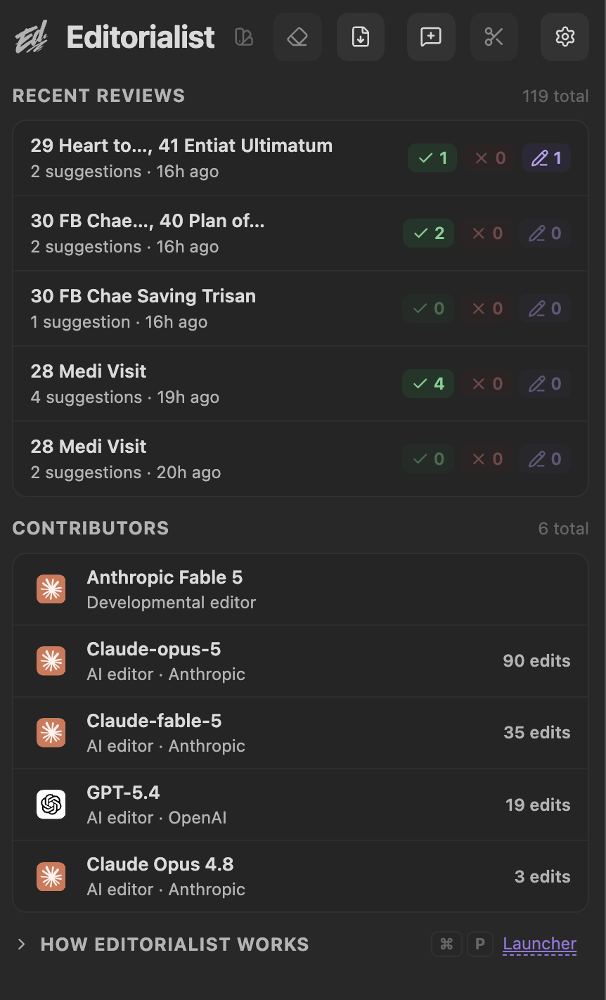
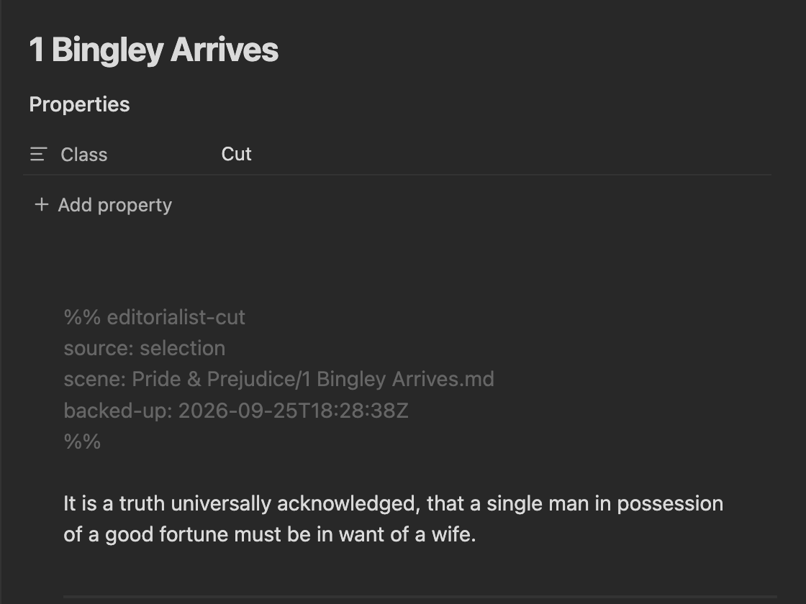

The Review mode is traditional Editorialist: scene-level review batches with line edits, cut / move / condense / expand suggestions, `%%ai: question%%` responses, and memos for a scene. Open it with the **Open review panel** command or choose **Review** from the mode menu.

## Idle state

<p align="center"></p>

Between sessions the panel shows:

- **Active book** — which book Editorialist is currently scoped to (via [Radial Timeline](Radial-Timeline-Integration) when installed).
- **Pending workflow cards** — imported batches and pending edits waiting for review, each with a start button.
- **Recent activity** — the latest decisions and completed sweeps.
- **Contributors** — a compact view of who has been suggesting what.
- **Onboarding** — a collapsible getting-started disclosure for new vaults.

### Panel controls

<p align="center"></p>

The header controls keep the most common actions close to the review panel:

| Control | What it does |
|---|---|
| **Toggle modes** | Switch between Review, [Pending edits](Pending-Edits), and [Editorialisms](Editorialisms-Panel). |
| **Erase batches** | Remove imported review batches after you are done with them. |
| **Open review launcher** | Opens the launcher modal to import a review batch or start a pending-edits review. |
| **Insert author query** | Adds a hidden `%%ai: …%%` marker for the next review pass. |
| **Select text and backup to cut file** | Copy selected manuscript text into the scene's cut file. |
| **Settings** | Open Editorialist settings. |

## Review sessions

Starting a workflow card (or importing a review batch) begins a **guided review sweep**. The imported batch has already been split into review blocks at the bottom of the targeted scene notes; the panel reads those blocks and walks their suggestions scene by scene. A scene can hold multiple batches from different manuscript shares or review passes.

<p align="center"></p>

### What a batch can ask you to do

| Type | How it helps during a sweep |
|---|---|
| **Edit** | Compare the original passage with a proposed replacement. |
| **Move** | Send a passage to a specific before / after destination. |
| **Cut** | Remove a passage, optionally backing it up to the scene's cut file first. |
| **Condense** | Tighten an overlong beat into a shorter version. |
| **Expand** | Add development, pacing, interiority, or connective tissue. |
| **Memo** | Capture general scene thoughts, strengths, issues, or reviewer context without applying a line edit. |

### Navigation and filters

- **Previous / next** moves through suggestions; the sweep hands off to the next scene when the current one is resolved.
- **Jump to** — each suggestion card has a jump menu: jump to the suggested text in the editor, to its source review block, or (for a move) to the destination anchor.
- **Contributor filter** — appears only when a session contains suggestions from **more than one contributor**. A dropdown limits the view to one contributor, and a star button shows only [starred contributors](Settings-Reference#contributors-tab). With a single-reviewer batch the row stays hidden.
- **Collapse controls** — fold away processed suggestions, pending edits, and comments to reduce noise.

### The suggestion toolbar

<p align="center"></p>

Each highlighted suggestion gets an inline toolbar in the editor:

| Action | Trigger | Effect |
|---|---|---|
| **Previous** | Click | Select the previous suggestion in the session |
| **Next** | Click | Select the next suggestion in the session |
| **Apply** (Edit / Cut / Condense / Expand / Move) | Click | Apply this suggestion to the prose |
| **Apply and advance** | Shift + click | Apply, then jump to the next suggestion |
| **Apply to all** | Shift + Cmd + click | Stage every eligible suggestion in this scene and show a Cancel/Confirm bar — see [Apply to all](#apply-to-all) below |
| **Defer** | Click | Skip for now; the sweep can finish later |
| **Rewrite myself** | Click | Take the suggestion as a prompt and write your own version |
| **Backup to cut file** | Click | Archive the target text to the [cut file](Settings-Reference#configuration-tab) before deciding |
| **Open cut file** | Shift + click Backup to cut file | Open the scene's cut file |
| **Reject** | Click | Decline the suggestion |
| **Undo** | Click | Replaces Reject once you've just applied a change — undoes that single applied edit (see [Undo](#undo)) |
| **Hide toolbar** | Click | Dismiss the overlay without deciding |
| **`*` legend** | Hover or focus | Reveals a compact reference for every action's icon and modifier-key shortcut |

An **↑ / ↓** indicator next to the Hide-toolbar button shows, for Move suggestions, whether the destination anchor is above or below the highlighted text.

### Status chips

The toolbar's meta row shows the current operation type, plus:

- **Scene progress** — a label for where this scene sits in a multi-scene sweep.
- **`Entry n/N`** — the selected suggestion's position among all suggestions in the session.
- Conditional counts, shown only when their count is greater than 0: **N accepted**, **N pending**, **N rejected**, **N unresolved** (hover for which suggestion numbers), **N deferred**, **N rewritten**.
- A green **"sweep complete"** chip once every suggestion in the scene has a resolved status.

### Apply to all

Shift + Cmd + click on **Apply** stages every eligible suggestion in the current scene — not just suggestions of the same type as the one you clicked — and swaps the toolbar into a **"Apply to all?"** confirm bar showing how many changes are staged, with **Cancel** and **Confirm** buttons. Nothing is written to the note until you click **Confirm**. Suggestions that are unresolved (their target text couldn't be matched), already decided, or moves (which need a destination decided individually) aren't included.

### Toolbar modes

The toolbar isn't only the per-suggestion editor above — it switches to a different mode depending on where you are in the sweep. In order of priority:

| Mode | When you see it | Title | Actions |
|---|---|---|---|
| **pending_edits_review** | Working the [Pending Edits](Pending-Edits) queue | "Pending edits" | Previous, Next (leave item in pending edits), Complete and remove from pending edits, Backup to cut file |
| **applied_review** | Reviewing changes just written by Apply to all | "Review applied changes" | Previous, Next, Undo |
| **completed_review** | Every suggestion in the batch is resolved | "All revisions complete" | Previous, Next, Undo (if a change is still undoable) |
| **accepted_review** | Nothing else needs a decision but you're looking back at what was accepted | "Review accepted changes" | Previous, Next, Undo (if available) |
| **handoff** | The current scene's revision notes are all resolved and the sweep can move on | "Scene complete" (or "Note complete"), or "All revision notes are resolved" on the final scene | Next scene / Finish sweep |
| **panel** | Open suggestions remain further down the note than the visible editor viewport | "Continue in this scene" / "this note" | none — resume from the side panel, not the editor toolbar |
| **bulk_confirm** | Right after Shift + Cmd + click on Apply | "Apply to all?" | Cancel, Confirm |
| **review** | A suggestion is selected and still open | operation badge + status chips | the full action set above |

`handoff`, `panel`, and the "All revisions complete" state of `completed_review` are ordinary stops in a normal sweep, not error states — they mean, respectively: this scene is done and ready to advance; there's more to do further down the note than fits the current view; and the whole batch is fully decided.

### Directives in this scene

When the scene under review is covered by [Editorialism](Editorialisms-Panel) directives, they appear in a **Directives in this scene** card in the panel, above the suggestion list. The card is present for the whole session — while you work the suggestions, at the scene-complete handoff, and after the batch is finished.

Each directive shows its status, its text, and the Editorialism and section it came from. Anchored passages that fall in this scene are listed beneath it; clicking one opens the passage the same way the Editorialisms panel does. Clicking a status cycles it through the five states and writes the change to the Editorialism file.

A directive whose scope covers this scene while its passages sit elsewhere names those scenes — "None here — 2 passages in scenes 26 and 27" — so a range- or subplot-scoped note still points somewhere. Those scenes are named, not linked: leaving mid-sweep would abandon the batch you are working, so walking a directive across scenes stays the [Editorialisms panel](Editorialisms-Panel)'s job. A directive with no anchored passages at all says that plainly, rather than offering a jump that would land somewhere approximate.

Two behaviors are deliberate:

- **Directives never block sweep completion.** They are not part of the batch. A sweep finishes on its suggestions alone, whatever state the directives are in.
- **There is no Apply.** A directive carries no replacement prose, so nothing here is ever written to the manuscript. Marking every anchor in a scene processed also does not mark the directive done — that stays your call.

Directives scoped to the whole manuscript do not appear here: they apply everywhere, so they cannot point at a passage in this scene.

### Cut-file preview

<p align="center"></p>

When you use **Backup to cut file**, Editorialist writes the selected passage to the scene's cut file before you decide what to do with the suggestion. The cut file keeps the archived text with source metadata, while the review suggestion stays active until you accept, reject, rewrite, or defer it.

### Suggestion statuses

Every suggestion moves through an explicit lifecycle:

```
pending ──→ accepted
       ──→ rejected
       ──→ rewritten   (you applied your own version)
       ──→ deferred    (decide later; blocks sweep completion until resolved)
       ──→ unresolved  (couldn't be matched or needs attention)
```

### Undo

Only the single most-recently applied change can be undone, and only for as long as you stay on that note — navigate away and it's final. Rejecting, deferring, and rewriting have no undo. Suggestions whose target text can't be found in the note (paraphrased targets, already-applied edits) are flagged by match type — exact, multiple matches, not found, or already applied — so nothing is ever applied against the wrong text.

### Sweep completion

A sweep finishes only when every suggestion in the batch has a resolved status (accepted, rejected, or rewritten). If pending, unresolved, or deferred items remain, Editorialist pauses and tells you what's left. On completion, the batch is recorded: per-scene polish frontmatter (`Editorialist.revision`, `Editorialist.revision_updated`), contributor acceptance stats, and the activity history all update.

The **All revisions complete** card keeps the scene's memos and any [directives for this scene](#directives-in-this-scene) beneath it, so the reviewer's framing is still readable after the pass rather than only during it. A comments card you collapsed while sweeping is reopened when the pass completes; collapsing it again in the completion view stays collapsed. **Review changes** re-enters the batch to walk what you accepted, and the memos stay in view there too.

## Pending-edits review

See [Pending Edits](Pending-Edits) — its own panel mode, which the Review panel points to when the active book or current scene has pending author notes or Radial Timeline Inquiry follow-ups.
