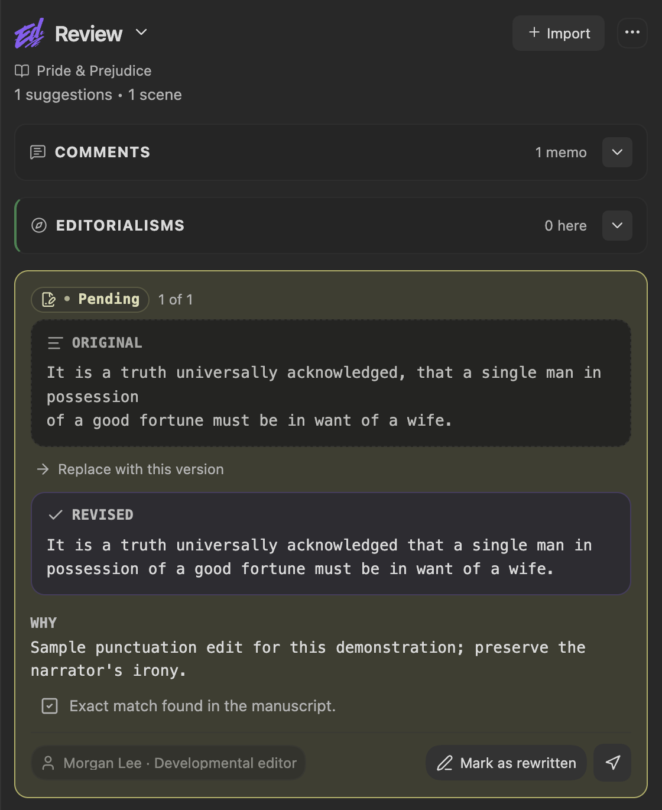
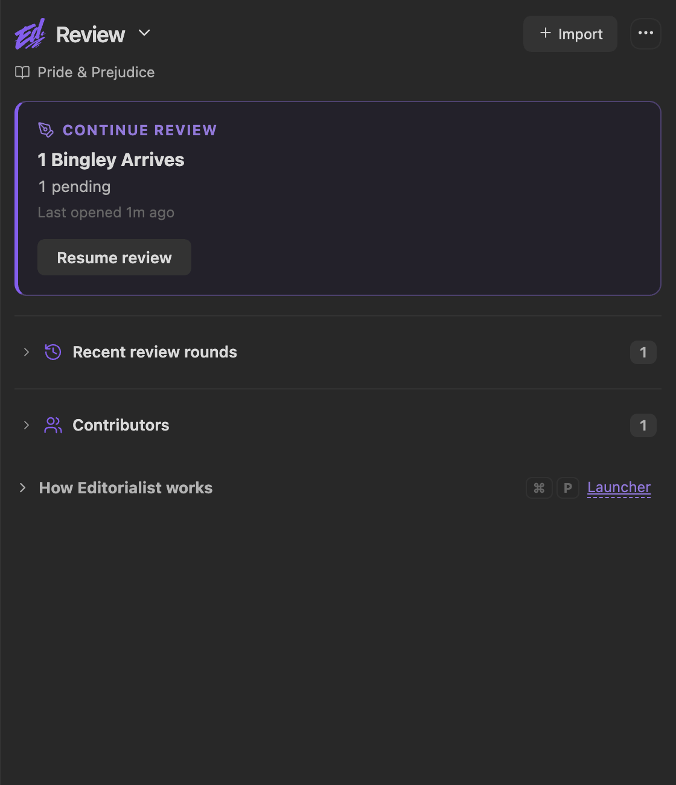
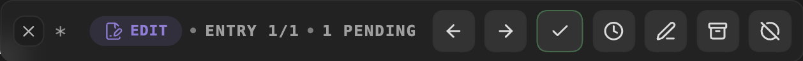
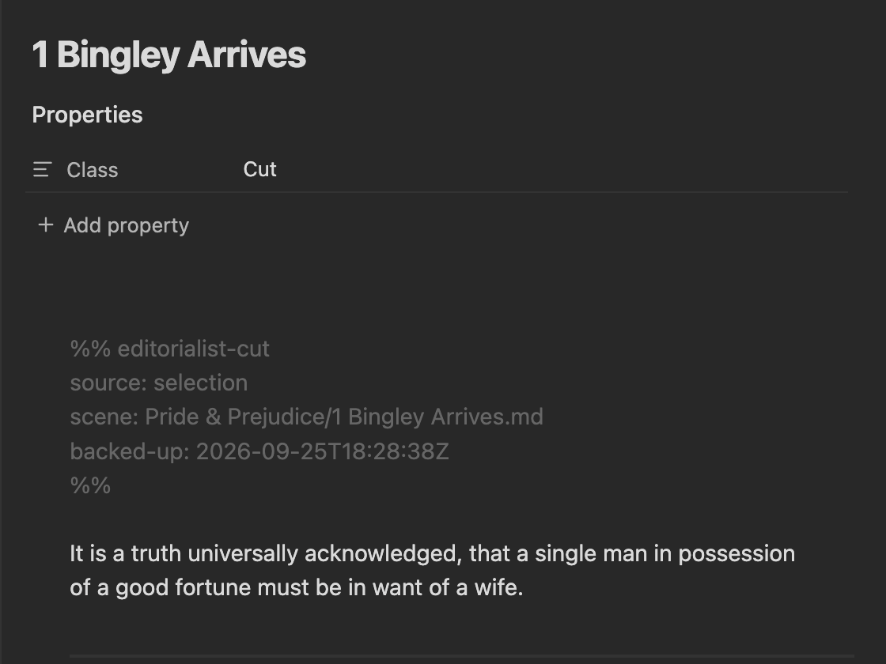

The Review mode is traditional Editorialist: scene-level review batches with line edits, cut / move / condense / expand suggestions, `%%ai: question%%` responses, and memos for a scene. Open it with the **Open review panel** command or choose **Review** from the mode menu.

<p align="center"></p>

## Idle state

<p align="center"></p>

Between sessions the panel shows:

- **Active book** — which book Editorialist is currently scoped to (via [Radial Timeline](Radial-Timeline-Integration) when installed).
- **Continue review / Next in sweep** — the scene to pick up next, with **Resume review** or **Start scene**. Pending edits has its own mode.
- **Up next** — the other scenes with suggestions still to review, in story order. Click a row to open that scene's review.
- **Reviewed** — every scene you have finished, in the same rows and story order as Up next, directly beneath it. Click a row to reopen that scene's review and step back through what you decided. A scene you have already cleaned has no review block left, so its row simply opens the scene and shows when it was cleaned; rows whose review block is still in the note keep a **Clean** button.
- **Recent review rounds** — a disclosure with your recent import rounds and each round's accepted, rejected, and rewritten counts.
- **Contributors** — a compact view of who has been suggesting what.
- **How Editorialist works** — a collapsible overview of the workflows, opened automatically only in a new vault.

### Panel controls

| Control | What it does |
|---|---|
| **View name / chevron** | Choose Revision plan, Review, Pending edits, or Editorialisms. The Ed logo stays the same. |
| **Import** | Open the launcher. At narrow widths this becomes a **+** button. |
| **… → Editorial deliveries** | Group batches and Editorialism files by handoff, record dates, and start planning. |
| **… → Insert author query** | Add a hidden `%%ai: …%%` question to the manuscript. |
| **… → Open cut file** | Open the active scene’s existing cut file. |
| **… → Clean resolved batches** | Remove resolved imported review blocks. |
| **… → End current round** | End selected batches and remove unfinished feedback without counting it as rejected. Manuscript changes and recorded decisions remain. |
| **… → Settings** | Open Editorialist settings. |

Use the editor toolbar, right-click menu, or command palette to back up selected prose to a cut file.

## Review sessions

Starting a workflow card (or importing a review batch) begins a **guided review sweep**. The imported batch has already been split into review blocks at the bottom of the targeted scene notes; the panel reads those blocks and walks their suggestions scene by scene. A scene can hold multiple batches from different manuscript shares or review passes.


### What a batch can ask you to do

| Type | How it helps during a sweep |
|---|---|
| **Edit** | Compare the original passage with a proposed replacement. |
| **Move** | Send a passage to a specific before / after destination. |
| **Cut** | Remove a passage, optionally backing it up to the scene's cut file first. |
| **Condense** | Tighten an overlong beat into a shorter version. |
| **Expand** | Add development, pacing, interiority, or connective tissue. |
| **Memo** | Capture general scene thoughts, strengths, issues, or reviewer context without applying a line edit. |

### Advisory suggestions

**Condense** and **Expand** sometimes arrive as direction rather than replacement prose — there is nothing for Editorialist to write, so the card is labelled **Advisory** instead of Pending, and you resolve it by rewriting the passage yourself and clicking **Mark as rewritten**, or by rejecting it.


### Navigation and filters

- **Previous / next** moves through suggestions; the sweep hands off to the next scene when the current one is resolved.
- **Jump to** — each suggestion card has a jump menu: jump to the suggested text in the editor, to its source review block, or (for a move) to the destination anchor.
- **Contributor filter** — appears only when a session contains suggestions from **more than one contributor**. A dropdown limits the view to one contributor, and a star button shows only [starred contributors](Settings-Reference#contributors-tab). With a single-reviewer batch the row stays hidden.
- **Collapse controls** — fold away processed suggestions, pending edits, and comments to reduce noise.

### The suggestion toolbar

<p align="center"></p>

Each highlighted suggestion gets an inline toolbar in the editor:

| Action | Trigger | Effect |
|---|---|---|
| **Previous** | Click | Select the previous suggestion in the session |
| **Next** | Click | Select the next suggestion in the session |
| **Apply** (Edit / Cut / Condense / Expand / Move) | Click | Apply this suggestion to the prose |
| **Apply and advance** | Shift + click | Apply, then jump to the next suggestion |
| **Apply to all** | Shift + Cmd + click | Stage every eligible suggestion in this scene and show a Cancel/Confirm bar — see [Apply to all](#apply-to-all) below |
| **Defer** | Click | Skip for now; the sweep can finish later |
| **Rewrite myself** | Click | Take the suggestion as a prompt and write your own version |
| **Backup to cut file** | Click | Archive the target text to the [cut file](Settings-Reference#configuration-tab) before deciding |
| **Open cut file** | Shift + click Backup to cut file | Open the scene's cut file |
| **Reject** | Click | Decline the suggestion |
| **Undo** | Click | Replaces Reject once you've just applied a change — undoes that single applied edit (see [Undo](#undo)) |
| **Hide toolbar** | Click | Dismiss the overlay without deciding |
| **`*` legend** | Hover or focus | Reveals a compact reference for every action's icon and modifier-key shortcut |

An **↑ / ↓** indicator next to the Hide-toolbar button shows, for Move suggestions, whether the destination anchor is above or below the highlighted text.

### Status chips

The toolbar's meta row shows the current operation type, plus:

- **Scene progress** — a label for where this scene sits in a multi-scene sweep.
- **`Entry n/N`** — the selected suggestion's position among all suggestions in the session.
- Conditional counts, shown only when their count is greater than 0: **N accepted**, **N pending**, **N rejected**, **N unresolved** (hover for which suggestion numbers), **N deferred**, **N rewritten**.
- A green **"sweep complete"** chip once every suggestion in the scene has a resolved status.

### Apply to all

Shift + Cmd + click on **Apply** stages every eligible suggestion in the current scene — not just suggestions of the same type as the one you clicked — and swaps the toolbar into a **"Apply to all?"** confirm bar showing how many changes are staged, with **Cancel** and **Confirm** buttons. Nothing is written to the note until you click **Confirm**. Suggestions that are unresolved (their target text couldn't be matched), already decided, or moves (which need a destination decided individually) aren't included.

### Toolbar modes

The toolbar isn't only the per-suggestion editor above — it switches to a different mode depending on where you are in the sweep. In order of priority:

| Mode | When you see it | Title | Actions |
|---|---|---|---|
| **pending_edits_review** | Working the [Pending Edits](Pending-Edits) queue | "Pending edits" | Previous, Next (leave item in pending edits), Complete and remove from pending edits, Backup to cut file |
| **applied_review** | Reviewing changes just written by Apply to all | "Review applied changes" | Previous, Next, Undo |
| **completed_review** | Every suggestion in the review you're in is decided | The same title as the panel's completion card: "Scene complete", "Batch complete", or "All revisions complete" | Previous, Next, Undo (if a change is still undoable) |
| **accepted_review** | Nothing else needs a decision but you're looking back at what was accepted | "Review accepted changes" | Previous, Next, Undo (if available) |
| **handoff** | The current scene's revision notes are all resolved and the sweep can move on | "Scene complete" (or "Note complete"), or "All revision notes are resolved" on the final scene | Next scene / Finish sweep |
| **panel** | Open suggestions remain further down the note than the visible editor viewport | "Continue in this scene" / "this note" | none — resume from the side panel, not the editor toolbar |
| **bulk_confirm** | Right after Shift + Cmd + click on Apply | "Apply to all?" | Cancel, Confirm |
| **review** | A suggestion is selected and still open | operation badge + status chips | the full action set above |

`handoff`, `panel`, and `completed_review` are ordinary stops in a normal sweep, not error states — they mean, respectively: this scene is done and ready to advance; there's more to do further down the note than fits the current view; and everything in the review you're in is decided. For what each completion title means, see [Sweep completion](#sweep-completion).

### Editorialisms

When the scene under review is covered by [Editorialism](Editorialisms-Panel) directives, they appear in an **Editorialisms** card in the panel, above the suggestion list. The card is present for the whole session — while you work the suggestions, at the scene-complete handoff, and after the batch is finished. It starts folded, and its header already says whether there is work in this scene: **2 here · 3 elsewhere** counts unfinished directives with work in this scene against those whose passages all sit in other scenes.

**What leads.** The card puts the work you can do here first:

1. Directives with passages in this scene.
2. Directives whose range or subplot covers this scene without naming particular passages. These show their reach, such as "Across scenes 13–22".
3. Directives whose passages all live in other scenes, folded behind one **N more with passages in other scenes** line.

Within each group, directives with open passages here come first, and a directive still waiting on a decision comes before one that only needs carrying out, because the decision unblocks every passage it names. Finished directives stay on the card, struck through and sorted last, so you can see a click you made by mistake and undo it. The card also hides a leading tracking code (such as `C04 —`) and markdown emphasis to keep the text readable. Your Editorialism file is never rewritten.

**One at a time.** When more than one directive belongs to this scene, the card shows one at a time: **1 of 4**, a **Next** button (**Back to first** at the end), and **Show all** for the full list. The full list offers **One at a time** to go back. Marking the directive you are on done moves you to the next one; the finished directive stays at the end of the list. Moving to another scene starts again from the top.

**Status circles.** You get one status circle for each piece of work in this scene. A directive with a single passage here has one circle, and it tracks that passage. A directive with several passages here gives each passage its own circle and none to the sentence. A directive with no passages here carries its own status. Clicking a circle opens a menu naming every status (**Open**, **In progress**, **Done**, **Deferred**, **Question**) with the current one checked. Your choice is written to the Editorialism file. The menu also offers:

- **Mark the whole directive done** (or **Reopen the whole directive**), on a passage's menu, so the directive's own status is always within reach.
- **Ask a question…** (or **Edit your question…**), described below.
- **Draft fixes with AI…** copies a prompt asking an AI for a review batch that carries out this directive. Your recorded decision goes with it, and you import the reply like any other batch. See [Handing directives to AI](Editorialisms-Panel#handing-directives-to-ai).

**Getting to the passage.** Click the directive's sentence to jump to the first open passage it names in this scene, or click a quoted passage (marked with a locate icon) to jump to that one. The passage flashes briefly in the editor so your eye finds it. With reduced motion turned on, it holds a stronger highlight instead.

**Decisions and questions.** A directive that asks you to choose ("Choose her age", or a `[?]` item) shows **Decision needed** with a **Decide** button. Your answer is written to the directive's line as `[decision:: …]`. From then on **Decided: …** leads the directive, with **Change** beside it, so each passage becomes a quick check against an answer you already gave. Choosing **Question** from a status menu, or **Ask a question…**, asks you to write the question down. It is saved on the line as `[question:: …]` and shown under the directive as **Your question**, with **Edit**. Cancelling changes nothing. See [Decisions](Editorialisms-Panel#decisions) and [Questions](Editorialisms-Panel#questions) for the full behavior.

**Passages in other scenes.** A directive whose passages all sit elsewhere says where they are, for example "2 passages in scenes 26 and 27". Those scenes are named, not linked. Leaving mid-sweep would abandon the batch you are working, so walking a directive across scenes stays the [Editorialisms panel](Editorialisms-Panel)'s job.

**On the suggestion card.** When the selected suggestion sits in a paragraph that an open passage of an unfinished directive also names, the suggestion card shows that directive under **Editorialism on this passage**. Its **Done** button marks just this passage done, so you can deal with the structural note while you are already in the prose. Whether the directive as a whole is finished is still yours to set in the Editorialisms card. A directive that needs a decision shows **Decision needed** and **Decide** here too. Matching works by paragraph, so a line edit and a directive's quoted fragment don't need to cover the same words. A passage you have rewritten past recognition stops matching rather than pointing somewhere wrong.

Two behaviors are deliberate:

- **Directives never block sweep completion.** They are not part of the batch. A sweep finishes on its suggestions alone, whatever state the directives are in.
- **There is no Apply.** A directive carries no replacement prose, so nothing here is ever written to the manuscript. Marking every passage in a scene done also does not mark the directive done — that stays your call.

Directives scoped to the whole manuscript do not appear here: they apply everywhere, so they cannot point at a passage in this scene.

### Context across scenes

Many revision decisions involve more than one scene: a hat worn in three scenes, a reunion that a later scene already treats as fact, an age that has to agree in six places. When other scenes bear on the selected suggestion, its card gains an **Across scenes** row listing them by number. Expand it to read the relevant paragraphs without leaving the scene you're reviewing.

Each paragraph is labelled with the reason it is shown:

| Label | Where it comes from |
|---|---|
| **Quoted reference** | A verbatim fragment from the entry's optional `Context:` field, or a passage in another scene named by an Editorialism directive on this paragraph |
| **Shares …** | A scene the suggestion's Why mentions by number ("scene 65"), narrowed to the paragraphs that share the suggestion's distinctive names, such as **Shares Terminus, XO** |

If a scene the Why mentions has no paragraph sharing a name, nothing is shown for it rather than an arbitrary paragraph. Long paragraphs are clipped; click one to read it in full. The section shows up to five scenes and three paragraphs per scene. Reviewers add `Context:` to an entry when a fix depends on another scene; see [Importing Reviews § Context across scenes](Importing-Reviews#context-across-scenes). Context is never applied to your prose.

**Open beside** opens that scene in a side pane without taking focus and selects the paragraph, so you keep your place in both the scene and the review. Every jump reuses the same side pane instead of piling up tabs. If the paragraph has changed since it was found, the scene still opens and a notice tells you, rather than selecting the wrong text.

**Find selection across scenes.** To check a detail yourself, select a word or short phrase on one line and run **Find selection across scenes** from the command palette, or choose **Ed — find across scenes** from the editor's right-click menu. A window lists every paragraph in the active book that contains it, ignoring case, grouped by scene in story order, each with **Open beside**. You don't need an active review for this. A very common phrase shows only the first matches; narrow it to see the rest.

Both features read only manuscript prose. Frontmatter, comments, headings, code blocks, and review blocks are never matched.

### Cut-file preview

<p align="center"></p>

When you use **Backup to cut file**, Editorialist writes the selected passage to the scene's cut file before you decide what to do with the suggestion. The cut file keeps the archived text with source metadata, while the review suggestion stays active until you accept, reject, rewrite, or defer it.

### Suggestion statuses

Every suggestion moves through an explicit lifecycle:

```
pending ──→ accepted
       ──→ rejected
       ──→ rewritten   (you applied your own version)
       ──→ deferred    (decide later; blocks sweep completion until resolved)
       ──→ unresolved  (couldn't be matched or needs attention)
```

### Undo

Only the single most-recently applied change can be undone, and only for as long as you stay on that note — navigate away and it's final. Rejecting, deferring, and rewriting have no undo. Suggestions whose target text can't be found in the note (paraphrased targets, already-applied edits) are flagged by match type — exact, multiple matches, not found, or already applied — so nothing is ever applied against the wrong text.

### Sweep completion

A sweep finishes only when every suggestion in the batch has a resolved status (accepted, rejected, or rewritten). If pending, unresolved, or deferred items remain, Editorialist pauses and tells you what's left. On completion, the batch is recorded: per-scene polish frontmatter (`Editorialist.revision`, `Editorialist.revision_updated`), contributor acceptance stats, and the activity history all update.

The completion card depends on whether the whole import batch is decided, not just the scene in front of you:

| Card | When you see it | What it offers |
|---|---|---|
| **Scene complete** (or **Note complete**) | You finished this scene, but other scenes in the same batch still have suggestions to review | A quiet checkpoint that says how many scenes in the batch remain, with **Review changes** and **Close review** |
| **Batch complete** | Every scene in the batch is decided, and other scenes in the book still have pending batches | **Clean review blocks**, **Review changes**, **Import new revision notes**, **Close review** |
| **All revisions complete** | Every scene in the batch is decided and nothing else is pending | The same actions as Batch complete |

The checkpoint never offers Clean. Cleaning removes review blocks from every scene in a batch, so cleaning early would strip them from scenes you haven't reviewed yet. Editorialist won't clean a batch until all its scenes are decided. Once a batch has been cleaned, its card offers only **Import new revision notes** and **Close review**.

When other scenes still hold pending batches, the **Continue review** / **Next in sweep** card and the **Up next** list follow the completion card, so you can go straight on to the next one.

A completion duration is shown only for a finished batch that recorded a real start time. A pass that finished as a single-scene session has no such timestamp, so it reports no duration rather than an approximate one.

The completion card keeps the scene's memos and any [Editorialisms](#editorialisms) beneath it, so the reviewer's framing is still readable after the pass rather than only during it. A comments card you collapsed while sweeping is reopened when the pass completes; collapsing it again in the completion view stays collapsed. **Review changes** re-enters the batch to walk what you accepted, and the memos stay in view there too.

## Pending-edits review

See [Pending Edits](Pending-Edits) — its own panel mode, available from the shared mode selector for active-book author notes and Radial Timeline Inquiry follow-ups.
