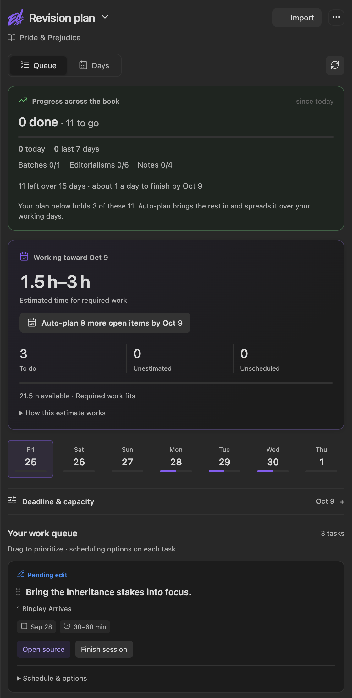
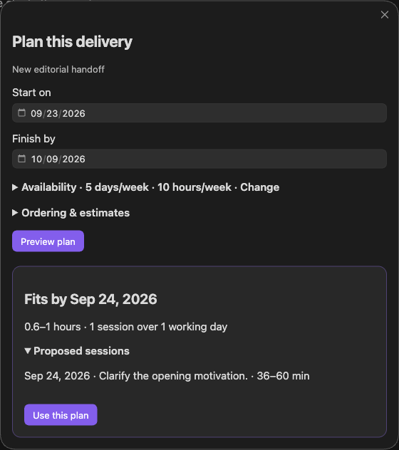

Revision plan brings pending edits, scene batches, and Editorialism checklist items into one ordered work queue. Open it from the panel mode picker or run **Open revision plan**.

## Build a plan

1. Set your book deadline, working minutes for each weekday, and reserve time in **Deadline & capacity**. Zero minutes means a day off.
2. Find work in **Available work**. Search by scene or instruction, and filter by Notes, Batches, Editorialisms, or delivery.
3. Add items with **+**. Drag to prioritize, or use **Move up** and **Move down** in **Schedule & options**.
4. Set a day and a low/high effort range. Switch between **Queue** and **Days** to review the order or daily workload; tasks can also be dragged onto a day.

The forecast uses the high end of estimates and includes scheduled optional work in capacity. Unknown effort is never counted as zero. Missing sources, past dates, prerequisites, overloaded days, and delivery deadlines can all require attention. A forecast describes the selected work in your plan, not every unresolved note in the book.

## Work a session

**Open source** takes you to the underlying feedback. **Finish session** completes only the planning session: it does not accept a batch suggestion, check off an Editorialism, or remove a Pending edit. Resolve those in their source workflow. Source completion can also make its planned work complete.

**Schedule & options** holds the date, effort range, required-for-deadline flag, lock, prerequisite, and removal controls. **Remove from plan** preserves the source feedback. **Keep this date** protects the session during regeneration; manual editing remains available.

If an instruction changes or goes missing, refresh sources, choose its replacement, and click **Relink**. Its date and estimate are preserved. Keep unchanged agenda wording, scope, and section headings stable to avoid unnecessary relinking.

## Group an editor's delivery

Open **Editorial deliveries** from the panel's **…** menu. Record the handoff title, reviewer, role, received date, return deadline, and optional existing source note. Link the imported batches and Editorialism files belonging to that handoff. This does not import a document or duplicate feedback.

Receipt, file creation, and scheduled work dates are separate facts. Leave an unknown received date unknown. A source belongs to one delivery at a time; unlink it before moving it to another. See [Editorialisms: delivery tracking](Editorialisms-Panel#editorial-deliveries-dates-and-deadlines).

## Automatically plan a delivery

Open **Editorial deliveries**, then choose **Plan this delivery** on a delivery card. Link its batches and Editorialism files first. The planner uses unfinished, active work from that delivery; items already in your plan are not duplicated.

The first screen asks for your start date, finish date, and availability. Estimates are suggested automatically. Open **Ordering & estimates** only when you want to change the preset, session length, or individual estimates. Available presets:

- **Developmental revision:** structural decisions, then scene rewrites, then prose refinement; manuscript order within each phase.
- **Copy-edit pass:** manuscript order, grouped by scene.
- **Mixed editorial delivery:** structural decisions first, then rewrites and prose refinement together scene by scene.

Phase suggestions use words in the instruction, not an AI assessment of your manuscript. **Ordering & estimates → Review ordering & estimates** lets you change phases, enter effort ranges, or leave individual items out. Unknown phases or effort appear under **Needs attention** with a shortcut to adjust the item.

Set your planning window, session length, working minutes for each weekday, and reserve time. **Preview plan** previews the proposed sessions without saving. Scheduling uses the upper estimate, subtracts existing commitments, leaves reserve time at the end, and respects the earlier book or delivery deadline. Existing dated work without an estimate reserves its entire day. Work that cannot fit stays unscheduled; work lacking a phase or valid estimate stays in Available work.

Suggested effort is a starting assumption: existing Editorialism heuristics, or five minutes per remaining batch suggestion and fifteen per memo, with a ±25% range. Replace these with your own ranges when known. Large tasks split into numbered sessions that keep their original source link. **Finish session** completes only that planning session; it does not check off an Editorialism or accept suggestions.

**Use this plan** saves the plan and its defaults for this book. If feedback, the delivery, or the plan changes while the preview is open, reopen the planner and generate a fresh draft.

For later adjustments, choose **Adjust remaining schedule** on the delivery card. This is separate from planning new work. It retains manual tasks, completed sessions, other deliveries, locked sessions, and prerequisites of preserved tasks. Use **Keep this date** under a task's **Schedule & options** to preserve a commitment. Regeneration moves eligible existing sessions; it does not recalculate their effort or split them again.

## Storage

Plans, delivery links, and scheduling defaults are saved in plugin data per book. Feedback remains in the scene notes and Editorialism files. No calendar account or external scheduling service is required.
