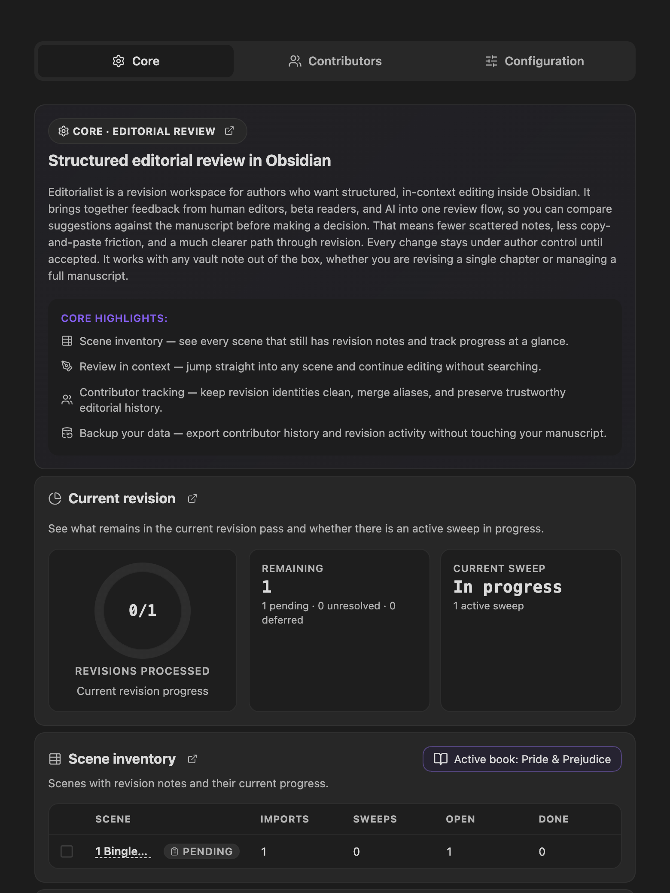
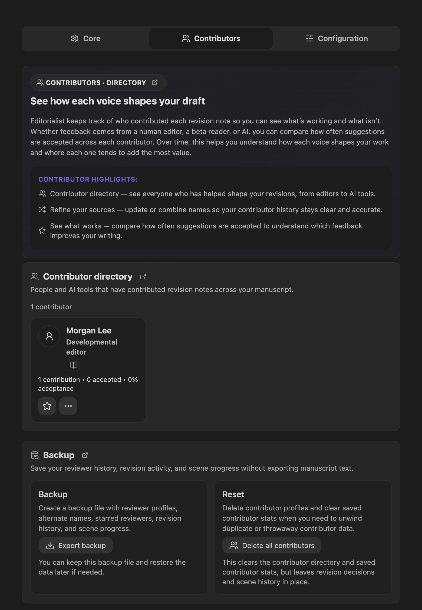
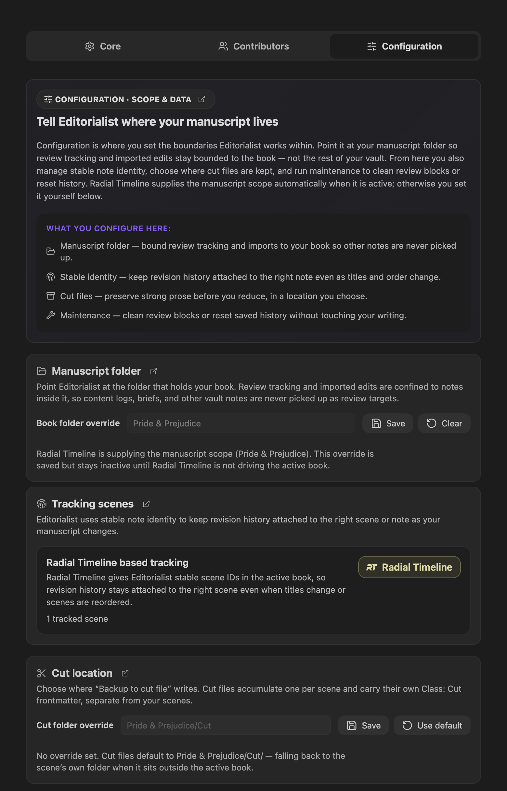

Editorialist's settings are organized into three tabs: **Core**, **Contributors**, and **Configuration**. Core is the dashboard; Configuration holds scope, tracking, cut-file, and maintenance controls.

---

## Core tab

**Core · Editorial review** — the dashboard for the active book's revision state.

### Radial Timeline card

If the [Radial Timeline](Radial-Timeline-Integration) plugin is not installed, a card explains what it adds and links to install it. With it installed, Editorialist scopes everything below to the active book.

### Revision progress

A pie chart of the current revision's completion, with metrics: tracked scenes, and remaining / accepted / rejected / rewritten counts.

### Scene inventory

A table of tracked scenes or notes that have imported revision notes:

| Column | Meaning |
|---|---|
| Completion | Per-scene polish state, from `Editorialist.revision` / `Editorialist.revision_updated` frontmatter |
| Scene | Scene name; with Radial Timeline installed, Status glyphs (**T**odo / **W**orking / **C**omplete) and Stage glyphs (**Z**ero / **A**uthor / **H**ouse / **P**ress) render from shared frontmatter |
| Imports | Review batches imported into the scene |
| Sweeps | Completed guided review sweeps |
| Open / Done | Suggestion counts |

Scenes with pending edits show a badge. When an active book or manuscript folder is set, a filter button narrows the table to that scope.

### Pending edits

When Radial Timeline is installed and has an active book, this section summarizes free-form revision notes collected from scene frontmatter: scene count, item count, human notes, and inquiry count. The **Start review** button launches the [pending-edits flow](Review-Panel#pending-edits-review) and is disabled when there is nothing to review.

### Revision history

Lifetime totals: total suggestions, accepted / rejected / rewritten actions, and completed sweeps.

---

## Contributors tab

**Contributors · Directory** — every reviewer who has ever contributed a batch, human or AI.

### Contributor directory

A card grid, one per contributor:

- **Identity** — display name, avatar (or AI provider brand icon, derived from the `Provider:` / `Model:` batch metadata), role icon, and strength icons.
- **Stats** — total suggestions, accepted, rewritten, and acceptance percentage.
- **Trusted badge** — earned at ≥5 suggestions with ≥80% acceptance.
- **Aliases** — alternate names that have been merged into this contributor.
- **Star** — mark a contributor to enable the starred-only filter in the [Review Panel](Review-Panel).
- **Manage (…)** — opens contributor actions:
  - *Edit* — display label, how you use the contributor (Developmental editor, Line editor, Copy editor, Beta reader, Generalist, AI assistant), and optional strengths (Clarity, Tone, Pacing, Dialogue, Structure, Character, Worldbuilding, Tightening).
  - *Reassign* — move all revision notes from this contributor into another contributor or a new contributor.
  - *Merge* — move all revision notes from this contributor into another existing contributor.

### Backup

- **Export backup** — writes a JSON file containing reviewer profiles, alternate names, starred reviewers, revision history, and scene progress.
- **Delete all contributors** — clears the contributor directory and saved contributor stats. Revision decisions and scene history stay in place.

---

## Configuration tab

**Configuration · Scope & data** — where review scope, tracking identity, cut-file location, and maintenance actions live.

### Manuscript folder

- **Book folder override** — points Editorialist at the folder that holds the manuscript. Review tracking and imports are confined to that folder.
- **Save** / **Clear** buttons apply or remove the override.
- If Radial Timeline supplies an active book source folder, that scope drives Editorialist and the override stays inactive until Radial Timeline is not driving the active book.

### Tracking

Shows which tracking mode is active and why:

| Mode | When |
|---|---|
| Radial Timeline based tracking | Radial Timeline is installed and an active book is set — scenes are tracked by Radial Timeline scene IDs |
| Using stable note IDs | Editorialist is using injected or existing frontmatter IDs for rename-safe tracking |
| Path-based tracking fallback | No stable IDs are available — notes are tracked by path |

When path-based tracking is active, **Inject stable note IDs** adds an `editorial_id` frontmatter field to tracked notes that do not already have one.

### Cut location

A cut file is a general-purpose archive, reachable wherever you are working:

- **Editor right-click** — select any passage and choose **Ed — backup selection to cut file**. The `Backup selection to cut file` command does the same from the palette.
- **Suggestion toolbar** — **Backup to cut file** archives the suggestion's target passage; Shift + click opens the cut file instead.
- **Side panel header** — the scissors button opens the active scene's cut file in the split below the panel.

Back a passage up before you accept a **Cut** if you want a copy kept. Accepting removes the passage from the manuscript immediately, and the only way back is the single-step, same-note [Undo](Review-Panel#undo).

The archive is a per-scene cut file — one per scene, named after the scene and tagged with its own `Class: Cut` frontmatter. Each archived block stores source, scene, and backup timestamp, plus operation, suggestion ID, contributor, and reason when they are available. Cut files are separate from review status and acceptance decisions: backing a passage up never changes a suggestion's status.

- **Cut folder override** — a path field. Leave empty to use the default: `<book-source-folder>/Cut` when a book context exists, otherwise `<scene-folder>/Cut`.
- **Save** / **Use default** buttons apply or clear the override.
- If a scene sits outside the active book folder, cut files fall back to that scene's own folder.

### Maintenance

Bulk operations. Cleanup actions ask for confirmation before removing review blocks:

- **Clean all scenes/notes** — remove imported review blocks from tracked scenes or notes. Accepted manuscript edits and saved history stay in place.
- **Clean completed scenes/notes** — remove imported review blocks only from completed scenes or notes.
- **Reset one batch** — remove saved decisions and stats for one batch. Only that batch's decisions go: when a note holds review blocks from several imports, the other batches keep theirs. Review blocks still present in notes are discovered again.
- **Reset all history** — clear saved batch history and decision stats. Review blocks still present in notes are discovered again.

---

## Good to know

- Importing a batch appends review blocks to scene notes; accepting suggestions is what changes manuscript prose.
- Cleaning review blocks removes imported blocks from notes but keeps accepted edits and saved history.
- Resetting saved history clears Editorialist's saved decisions and batch tracking, not review blocks still written into notes.
